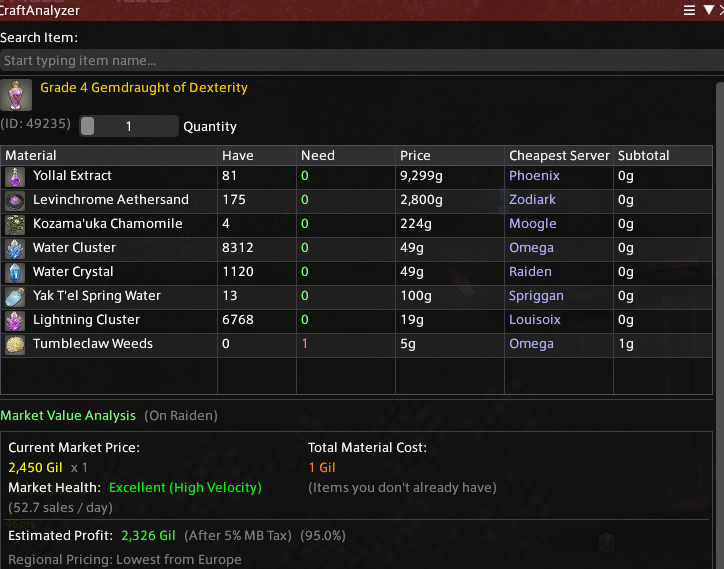

# 🛠️ CraftAnalyzer

**A Final Fantasy XIV Dalamud plugin that calculates the true cost of crafting and your actual profit margins across your entire Region.**

## 📖 About
Figuring out if an item is actually profitable to craft usually involves a lot of alt-tabbing, mental math, and checking multiple servers. 

**CraftAnalyzer** solves this natively inside the FFXIV client. By recursively reading your local game files to break down complex recipes into their base materials, and securely querying the Universalis API, this plugin tells you exactly how much it costs to craft an item if you buy the materials at their cheapest across your entire region (e.g., all of Europe or North America). 

It then compares that cost against the lowest selling price of the item on your Home World so you know your exact profit margin before you ever touch a craft.

## ✨ Features
* **Seamless Context Menu Integration:** Right-click any craftable item in your inventory, Crafting Log, or chat box and select **"See craft cost"**.
* **Region-Wide:** Automatically finds the absolute cheapest price for base materials across your entire physical region (e.g., Europe) and tells you exactly which server to travel to.
* **Smart Recipe Parsing:** Accurately accounts for recipe yields (e.g., crafting x3 Ingots) so your per-unit math is always flawless. 
* **Home World Profit Margins:** Compares your regional material costs against the selling price on your specific Home World, color-coding your net profit in green or red.
* **Search UI:** Includes a standalone search bar to manually look up items if you don't have them on hand.
* **TeamCraft Integration**: Click the **"Export to TeamCraft"** button to automatically generate a TeamCraft import link for all items you need to gather.
* **Smart Gathering Tracking**: Check the box next to each material to mark it as "To Be Gathered". The plugin will automatically adjust costs, exclude those items from total cost.

## 📥 Installation
This plugin is only distributed via a Custom Repository, because a lot of it is written by AI and moderated by myself. For any suggestions/bugs please use GitHub discussions or add me on Discord at rxfio.

1. In FFXIV, type `/xlsettings` in the chat to open the Dalamud Settings.
2. Navigate to the **Experimental** tab.
3. Scroll down to **Custom Plugin Repositories**.
4. Paste the following URL into a new line and click the `+` button:
   [https://raw.githubusercontent.com/kylohq/craft-analyzer/main/pluginmaster.json](https://raw.githubusercontent.com/kylohq/craft-analyzer/main/pluginmaster.json)